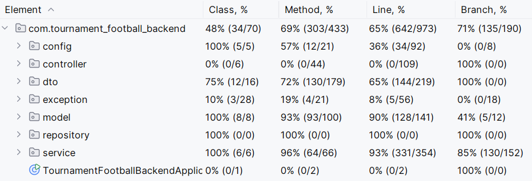

# Relazione Tecnica: Tournament Football Backend

## Indice

- [Introduzione e Visione del Progetto](#introduzione-e-visione-del-progetto)
- [Obiettivi](#obiettivi)
- [Scelte Tecniche e Architettura](#scelte-tecniche-e-architettura)
- [Organizzazione progetto](#organizzazione-progetto)
- [Strategia di Containerizzazione e Deployment](#strategia-di-containerizzazione-e-deployment)
- [Architettura Interna](#architettura-interna)
- [Come Eseguire il Progetto](#come-eseguire-il-progetto)
- [Database e Inizializzazione](#database-e-inizializzazione)
- [API Endpoints Principali - Come usare l'applicazione](#api-endpoints-principali---come-usare-lapplicazione)
- [Configurazione Ambiente](#configurazione-ambiente)
- [Sviluppi Futuri](#sviluppi-futuri)
- [Considerazioni Finali](#considerazioni-finali)

## Introduzione e Visione del Progetto

Ho sviluppato "**Tournament Football Backend**" come progetto per creare il backend di un'applicazione per gestire tornei di calcetto. L'idea è nata pensando a come digitalizzare la gestione di competizioni sportive che spesso vengono ancora organizzate con carta e penna. Il sistema che ho creato può essere usato in diversi modi:

- *Per organizzazioni sportive locali*: Un modo semplice per gestire tornei di calcetto tra amici o squadre amatoriali, tenendo traccia di squadre, partite e risultati.

- *Per centri sportivi*: Una soluzione più completa per chi deve gestire più tornei contemporaneamente con tante squadre e giocatori.

## Obiettivi

Gli obiettivi che mi sono posta nello sviluppo sono stati:

- Creare un'API REST che permetta di fare tutte le operazioni CRUD (creare, leggere, modificare, cancellare) su utenti, squadre, tornei e partite.
- Usare un database MySQL per salvare tutti i dati e implementare le relazioni tra le tabelle che abbiamo studiato nel corso (OneToOne, OneToMany, ManyToOne, ManyToMany).
- Implementare un sistema di login sicuro con token JWT e ruoli diversi (USER e ADMIN).
- Scrivere test per verificare che il codice funzioni bene (ho raggiunto oltre il 35% di copertura richiesta).
- Usare Docker per rendere facile l'installazione e l'esecuzione del progetto.
- Documentare tutte le API con Postman in modo che si possano testare facilmente

In sintesi, **l'obiettivo era creare un'API completa per gestire tornei di calcetto, con un sistema modulare per utenti, squadre, tornei e partite, usando tecnologie moderne e sicure**.

---

Una volta definita l'utilità dell'applicativo e gli obbiettivi da raggiungere, ho definito come farlo tecnicamente. Ho optato per Docker perché rende tutto più semplice da installare.
## Scelte Tecniche e Architettura

### Tecnologie Utilizzate
Il progetto è stato sviluppato utilizzando le seguenti tecnologie e strumenti:

#### Backend Framework
- **Spring Boot**: Versione **3.5.4**
- **Spring Security**: Autenticazione JWT e autorizzazione basata su ruoli
- **Spring Data JPA**: Persistenza dati e ORM
- **JWT**: Per i token di autenticazione

#### Database e Persistenza
- **MySQL**: Versione **8.0**, Database relazionale principale
- **H2**: Database temporaneo per i test
- **phpMyAdmin**: Per vedere e gestire il database facilmente

#### Build e Deployment
- **Maven**: Versione **3.9+** per gestione dipendenze e build
- **Docker**: Versione **20.10+** per containerizzazione
- **Docker Compose**: Versione **2.0+** per orchestrazione multi-container
- **Java**: Versione **21**

#### Testing
- **JUnit 5 + Mockito**: Per scrivere test automatici
- **Postman**: Utilizzato per testare le API
## Organizzazione progetto

L'applicazione si divide in 4 moduli principali che seguono il pattern MVC:

### Modulo User (Utenti)
**Cosa fa**: Gestisce gli utenti e l'autenticazione
- **Controller**: `AuthController`, `UserController`
- **Service**: `UserService`, `UserDetailsServiceImpl`
- **Repository**: `UserRepository`, `ProfileRepository`
- **Entità**: `User`, `Profile`
- **Relazioni JPA:** OneToOne (User ↔ Profile), ManyToMany (User ↔ Team)
- **Sicurezza:** JWT stateless, autorizzazione basata su ruoli (USER/ADMIN)
- **Funzionalità**: Autenticazione JWT, gestione profili, autorizzazioni, login, registrazione

### Modulo Team  (Squadre)
**Cosa fa**: Gestisce le squadre e i loro giocatori
- **Controller**: `TeamController`
- **Service**: `TeamService`
- **Repository**: `TeamRepository`
- **Entità**: `Team`
- **Relazioni JPA:** ManyToMany (Team ↔ Users e Tournament ↔ Teams)
- **Funzionalità**: Creare squadre, aggiungere/rimuovere giocatori, cercare squadre

### Modulo Tournament (Tornei)
**Cosa fa**: Gestisce i tornei dall'inizio alla fine
- **Controller**: `TournamentController`
- **Service**: `TournamentService`
- **Repository**: `TournamentRepository`
- **Entità**: `Tournament`
- **Relazioni JPA:** OneToMany (Tournament → Match), ManyToMany (User ↔ Team)
- **Stati Gestiti:** OPEN, IN_PROGRESS, COMPLETED, CANCELLED, SCHEDULED
- **Funzionalità**: Creare tornei, iscrivere squadre, gestire stati

### Modulo Match (Partite)
**Cosa fa**: Gestisce le partite e i risultati
- **Controller**: `MatchController`
- **Service**: `MatchService`
- **Repository**: `MatchRepository`
- **Entità**: `Match`
- **Relazioni JPA:** ManyToOne (Match → Teams (home/away) e Match → Tournament)
- **Stati Gestiti:** SCHEDULED, IN_PROGRESS, COMPLETED, POSTPONED, CANCELLED, TO_BE_SCHEDULED
- **Funzionalità**: Programmare partite, inserire risultati, consultare calendario
---

Stabilita l'architettura, per semplificare l'installazione e garantire che l'applicazione funzioni su qualsiasi computer ho usato Docker.
## Strategia di Containerizzazione e Deployment

### Architettura Multi-Container

L'adozione di Docker offre benefici significativi eliminando le problematiche di configurazione e garantendo comportamento uniforme su ambienti diversi. Con Docker, chiunque può far partire il progetto senza dover installare MySQL, configurare database o sistemare versioni diverse di Java.

```yaml
# docker-compose.yml - Orchestrazione Servizi
services:
  mysql:     # Database persistente con inizializzazione automatica
  app:       # Applicazione Spring Boot (build multi-stage)
  phpmyadmin: # Interface amministrazione database
```

Il docker-compose.yml orchestizza tre servizi:
1. **mysql**: Database MySQL 8.0 con inizializzazione automatica
2. **app**: Applicazione Spring Boot
3. **phpmyadmin**: Interface web per gestione database (porta 8081)

#### Mapping Porte
- **8080**: Applicazione Spring Boot
- **8081**: phpMyAdmin interface
- **3306**: MySQL database (connessioni esterne)

Questa strategia di containerizzazione con docker porta i seguenti vantaggi implementativi:

- **Configurazione automatica:** Tutto si installa e configura da solo
- **Dati di test:** Il database parte già con utenti, squadre e tornei di esempio
- **Funziona ovunque:** Stesso comportamento su Windows, Mac, Linux

---

Definito l'ambiente di esecuzione, è necessario approfondire come l'applicazione sia strutturata internamente. L'architettura a strati organizza i componenti secondo responsabilità specifiche.
## Architettura Interna

```
┌─────────────────┐
│   Controllers   │ ← Gestiscono le richieste HTTP
├─────────────────┤
│    Services     │ ← Contengono la logica di business
├─────────────────┤
│  Repositories   │ ← Si occupano del database
├─────────────────┤
│     Models      │ ← Rappresentano le tabelle del database
└─────────────────┘
```
### Organizzazione dei Package Principali
```
tournament-football-backend/
|-- src/
|   |-- main/
|   |   |-- java/
|   |   |   |-- com/
|   |   |       |-- tournament_football_backend/
|   |   |           |-- config/           # Configurazione sicurezza e JWT
|   |   |           |-- controller/       # Gestione richieste HTTP e definizione endpoint API RESTful.
|   |   |           |-- dto/              # Data Transfer Objects per trasferimento sicuro dati
|   |   |           |-- exception/        # Gestione eccezioni personalizzate
|   |   |           |-- model/            # Entità del dominio con relazioni JPA complete
|   |   |           |-- repository/       # Interfacce accesso dati con Spring Data JPA
|   |   |           |-- service/          # Logica di business principale e validazioni             
|   |   |           |-- TournamentFootballBackendApplication.java
|   |   |-- resources/
|   |       |-- application.properties    # Configurazione applicazione
|   |       |-- schema.sql                # Script definizione schema database completo
|   |       |-- data.sql                  # Script inizializzazione dati di test realistici
|   |-- test/
|       |-- java/                         # Test unitari completi
|-- .env                                  # Variabili d'ambiente
|-- Dockerfile                            # Container applicazione
|-- docker-compose.yml                    # Orchestrazione servizi
|-- pom.xml                               # Configurazione Maven
|-- Tournament Football API.postman_collection.json
|-- README.md
```

---
### Controller Layer (Livello Presentazione)

I controller gestiscono le richieste HTTP e orchestrano le chiamate ai servizi:
- **AuthController**: Gestisce login e registrazione utenti
- **TeamController**: CRUD squadre e gestione giocatori
- **TournamentController**: CRUD tornei e iscrizioni squadre
- **MatchController**: CRUD partite e gestione risultati

Ogni controller:
- Controlla che i dati in input siano validi con `@Valid`
- Verifica che l'utente abbia i permessi giusti con `@PreAuthorize`
- Gestisce gli errori in modo appropriato
- Restituisce le risposte in formato JSON con `ResponseEntity`

---
### Service Layer (Logica di Business)
I servizi contengono la logica principale dell'applicazione:

- **UserService**: Gestione utenti, profili, validazioni unicità
- **TeamService**: Gestione squadre, assegnazione giocatori
- **TournamentService**: Gestione tornei, iscrizioni, validazioni date
- **MatchService**: Gestione partite, risultati, calendario
- **UserDetailsServiceImpl**: Si integra con Spring Security per l'autenticazione

---
### Repository Layer (Accesso al database)
Repository JPA per interazione con database (si occupano di "parlare" con il database):

- **UserRepository**:  Cerca utenti, gestisce login
- **TeamRepository**: Cerca squadre, trova squadre per giocatore
- **TournamentRepository**: Cerca tornei, filtra per stato/date
- **MatchRepository**:  Cerca partite, calcola statistiche
- **ProfileRepository**: Gestisce i profili utente

---
### Models (Rappresentazione dati)
Le entità rappresentano le tabelle del database:
- **User**: Rappresenta un utente registrato
- **Profile**: Rappresenta i dati personali di un utente
- **Match**: Rappresenta una partita
- **Team**: Rappresenta una squadra
- **Tournament**: Rappresenta un torneo

---
### Implementazione Relazioni JPA (Relazioni tra tabelle)

Il sistema implementa **tutte le tipologie di relazione** richieste:
- **OneToOne**: User ↔ Profile (ogni utente ha un profilo)
- **OneToMany**: Tournament → Matches (un torneo ha tante partite)
- **ManyToOne**: Match → Teams (home/away) (una partita appartiene a due squadre), Match → Tournament (una partita appartiene a un torneo)
- **ManyToMany**: Team ↔ Users (una squadra ha tanti giocatori),, Tournament ↔ Teams (un torneo ha tante squadre)

---
### DTO (Data Transfer Objects)
La strategia DTO implementa **separazione** tra entità interne e oggetti di trasferimento, per controllare meglio i dati che entrano ed escono:

- **CreateDTO:** Per quando creo qualcosa di nuovo (POST)
- **UpdateDTO:** Per quando modifico qualcosa (PUT)
- **ResponseDTO:** Per controllare cosa restituisco (GET)
- **Security:** Evito di esporre dati sensibili come le password

---
### Eccezioni
Per la gestione degli errori ho deciso di implementare una serie di eccezioni personalizzate che derivano dalla classe base `TournamentException`. Queste eccezioni sono suddivise in classi specifice per i diversi moduli:

- **TeamExceptions:** Eccezioni relative alla gestione delle squadre
- **UserExceptions:** Eccezioni relative alla gestione degli utenti
- **TournamentExceptions:** Eccezioni relative alla gestione dei tornei
- **MatchExceptions:** Eccezioni relative alla gestione delle partite
- **ValidationExceptions:** Eccezioni di validazione

La gestione centralizzata delle eccezioni è affidata alla classe **GlobalExceptionHandler**, che cattura le eccezioni di tipo **TournamentException** e **MethodArgumentNotValidException**. Per le eccezioni non gestite in modo specifico, viene fornita una risposta di errore generica `INTERNAL_SERVER_ERROR`.

### Sicurezza e autenticazione
Per la sicurezza ho usato:

- **WebSecurityConfig:** Configurazione generale di Spring Security
- **AuthTokenFilter:** Controlla il token JWT ad ogni richiesta
- **JwtUtils:** Crea e verifica i token JWT

#### Come funziona JWT
- **Algoritmo:** HS256 (HMAC con SHA-256)
- **Durata token:** 24 ore (configurabile via environment)
- **Secret key:** Configurabile tramite variabili d'ambiente (file .env)

#### Permessi degli endpoint
- **Pubblici** (`/auth/**`): Accesso libero per login/register
- **Autenticati**: Richiede token JWT valido
- **Solo ADMIN**: Solo gli amministratori possono fare certe operazioni
- **Proprietario o ADMIN**: Puoi vedere/modificare solo i tuoi dati (o tutto se sei admin)
---

### Test Automatici
**Copertura Raggiunta:** Superiore al 35% richiesto

| Test Suite | Focus Testing |
|------------|---------------|
| **MatchServiceTest** | Logica delle partite, controllo punteggi |
| **TeamServiceTest** | Gestione giocatori, ricerche |
| **TournamentServiceTest** | Stati dei tornei, logica complessa |
| **UserServiceTest** | Autenticazione, profili |
| **UserDetailsServiceImplTest** | Integrazione Spring Security |

**Come ho fatto i test:** Ho usato JUnit 5 + Mockito per simulare le dipendenze e testare vari scenari.

**Coverage**


### Esecuzione Test
Per eseguire i test automatici è consigliato utilizzare IntelliJ IDEA con plugin Maven.

#### Esecuzione con IntelliJ IDEA da terminale
1. Aprire il progetto in IntelliJ IDEA
2. Aprire il terminale integrato
3. Eseguire il comando:
   ```bash
   ./mvnw clean test
   ```
#### Esecuzione con IntelliJ IDEA GUI
IntelliJ IDEA permette di eseguire i test direttamente dall'interfaccia grafica:
1. Aprire il progetto in IntelliJ IDEA
2. Navigare su `Run` → `Run All Tests with Coverage`

---
## Come Eseguire il Progetto
### Requisiti
Per eseguire il progetto è necessario avere installato sul proprio sistema **Docker 20.10+** e **Docker Compose 2.0+**.
### Esecuzione applicazione con Docker e Docker Compose
Passi da seguire:

1. **Clonazione del Repository**
    ```bash  
    git clone <repository-url>
    cd tournament-football-backend
    ```

2. **Avviare i servizi con Docker Compose:**
   #### Avvia tutto l'ambiente (app + database + phpMyAdmin)
    ```
    docker compose up --build -d
    ```
   L'applicazione sarà accessibile a:
    - **API**: http://localhost:8080/api
    - **phpMyAdmin**: http://localhost:8081
    - **Database**: localhost:3306

3. **Verificare che i container siano attivi (opzionale)**
    ```bash
    docker compose ps
    ```

4. **Visualizzare tutti i log se qualcosa non va (opzionale)**
    ```bash
    docker compose logs -f
    ```

5. **Arrestare i servizi:**
    ```bash
    docker compose down
    ```
---
## Database e Inizializzazione

### Come Funziona l'Inizializzazione Database
1. **Docker Compose** avvia MySQL vuoto
2. **Spring Boot** si connette al database
3. **Schema.sql** crea automaticamente tutte le tabelle
4. **Data.sql** popola il database con dati di test realistici
5. **JPA/Hibernate** gestisce le entità create

### Dati di Test Preconfigurati

**Account di Test:**
- **Admin**: `admin` / `password123`
- **Admin Secondario**: `matteo_bronze` / `password123`
- **Utenti Standard**:
    - `mario_rossi` / `password123`
    - `luca_bianchi` / `password123`
    - `giuseppe_verdi` / `password123`

*Le password nei dati di test sono già hashate con BCrypt, ma per comodità la password in chiaro è `password123` per tutti gli utenti di test.*

**Dati Precaricati:**
- **15 utenti** con profili completi e dati realistici
- **12 squadre** con giocatori assegnati e nomi creativi
- **7 tornei** in diversi stati (OPEN, IN_PROGRESS, COMPLETED)
- **25+ partite** con risultati e calendario programmato
- **Relazioni complete** tra squadre-giocatori e tornei-squadre

### Schema Database
Il file `schema.sql` crea automaticamente:
- 7 tabelle principali (users, profiles, teams, tournaments, matches)
- 2 tabelle di relazione (team_players, tournament_teams)
- Vincoli di integrità referenziale
- Indici per performance ottimizzate

---

## API Endpoints Principali - Come usare l'applicazione

Ho creato **API REST complete** organizzate per funzionalità, seguendo gli standard REST e implementando sicurezza appropriata.

### Autenticazione (`/auth`)
- `POST /auth/login` - Login utente
- `POST /auth/register` - Registrazione

### Gestione Utenti (`/users`)
- `GET /users` - Lista utenti (ADMIN)
- `GET /users/search?keyword={keyword}` - Ricerca utenti (ADMIN)
- `GET /users/username/{username}` - Dettagli utente per username (ADMIN o proprietario)
- `GET /users/{id}` - Dettagli utente (ADMIN o proprietario)
- `PUT /users/{id}/profile` - Aggiorna profilo (ADMIN o proprietario)
- `PUT /users/{id}` - Aggiorna utente (ADMIN o proprietario)
- `DELETE /users/{id}` - Elimina utente (ADMIN)

### Gestione Squadre (`/teams`)
- `GET /teams` - Lista squadre
- `GET /teams/{id}` - Dettagli squadra
- `GET /teams/name/{name}` - Dettagli squadra per nome
- `POST /teams` - Crea squadra
- `PUT /teams/{id}` - Aggiorna squadra (ADMIN)
- `DELETE /teams/{id}` - Elimina squadra (ADMIN)
- `POST /teams/{teamId}/players/{playerId}` - Aggiungi giocatore (ADMIN)
- `DELETE /teams/{teamId}/players/{playerId}` - Rimuovi giocatore (ADMIN)
- `GET /teams/player/{playerId}` - Squadre per giocatore
- `GET /teams/search?keyword={keyword}` - Ricerca squadre

### Gestione Tornei (`/tournaments`)
- `GET /tournaments` - Lista tornei
- `GET /tournaments/{id}` - Dettagli torneo
- `POST /tournaments` - Crea torneo (ADMIN)
- `PUT /tournaments/{id}` - Aggiorna torneo (ADMIN)
- `DELETE /tournaments/{id}` - Elimina torneo (ADMIN)
- `POST /tournaments/{tournamentId}/teams/{teamId}` - Iscrivi squadra
- `DELETE /api/tournaments/{tournamentId}/teams/{teamId}` - Rimuovi squadra da torneo (ADMIN)
- `GET /tournaments/status/{status}` - Filtra per stato
- `GET /tournaments/upcoming` - Tornei futuri
- `GET /api/tournaments/team/{teamId}` - Tornei per squadra
- `GET /tournaments/search?keyword={keyword}` - Ricerca tornei

### Gestione Partite (`/matches`)
- `GET /matches` - Lista partite
- `GET /matches/{id}` - Dettagli partita per id
- `POST /matches` - Crea partita (ADMIN)
- `PUT /matches/{id}` - Aggiorna match (ADMIN)
- `PUT /matches/{id}/result` - Aggiorna risultato (ADMIN)
- `DELETE /matches/{id}` - Elimina partita (ADMIN)
- `GET /matches/tournament/{id}` - Partite per torneo
- `GET /matches/team/{id}` - Partite per squadra
- `GET /matches/status/{status}` - Partite per stato
- `GET /matches/period?start={start}&end={end}` - Partite per periodo
- `GET /matches/today` - Partite odierne

### Codici di Stato HTTP Utilizzati

| Codice | Significato | Utilizzo |
|--------|-------------|----------|
| **200 OK** | Operazione riuscita | Operazioni riuscite (GET, PUT) |
| **201 Created** | Risorsa creata | Quando creo qualcosa di nuovo (POST)|
| **400 Bad Request** | Dati input non validi | Quando i dati inviati non sono validis |
| **401 Unauthorized** | Token mancante/invalido | Quando manca o è sbagliato il token |
| **403 Forbidden** | Autorizzazioni insufficienti | Quando non hai i permessi |
| **404 Not Found** | Risorsa inesistente | Quando cerchi qualcosa che non esiste |
| **409 Conflict** | Conflitto| Quando provi a fare qualcosa di non permesso |

---
### Test delle API con Postman
Per facilitare i test delle API, è stata creata una Collection di Postman.
La Collection include tutte le richieste necessarie per testare le funzionalità dell'applicazione. La Collection è disponibile nel file `Tournament Football API.postman_collection.json` nella root del progetto.

**Importare Collection su Postman**
Per importare la Collection in Postman, basta seguire questi passaggi:
1. Aprire Postman.
2. Cliccare su "Importa" nella barra laterale sinistra.
3. Selezionare il file JSON della Collection.
4. Cliccare su "Importa".
5. La Collection sarà disponibile nella barra laterale sinistra di Postman.

#### Cosa include la collection
La Collection `Tournament Football API.postman_collection.json` include:

**Funzionalità Automatizzate:**
- **Gestione automatica del JWT**: Dopo il login, il token viene salvato e usato automaticamente
- **Variabili dinamiche**: Gli ID vengono estratti automaticamente e usati nelle richieste successive
- **Script automatici:**: Headers e validazioni automatiche

**Complete Testing Workflow:**
Ho creato una sequenza di 12 step che testa tutto dall'inizio alla fine::
1. Login Admin → Salva il token
2. User registration → Salva l'ID
3. Team creation (home/away) → Salva gli ID
4. Tournament creation → Salva l'ID
5. Team registrations → Testa la logica business
6. Match creation → Salva l'ID
7. Result update → Valida il tutto
8. Profile update → Testa la gestione utenti
9. Data verification → Controlla la coerenza

**Utilizzo:**
1. Importare collection in Postman
2. Eseguire "Complete Testing Workflow" per testare i 12 step principali
3. Oppure eseguire i singoli endpoint per testare funzionalità specifiche

*NOTA: è possibile che alcuni test presentino errori, in quanto sono stati creati per verificare la risposta del sistema a condizioni specifiche (es. errori di validazione, permessi insufficienti).*

**Test delle regole di business:**
- **Torneo pieno**: Prova a iscrivere più squadre del limite massimo
- **Squadra contro se stessa:** Prova a creare una partita con la stessa squadra casa e trasferta
- **Autorizzazioni**: Test accessi USER vs ADMIN
- **Token Scaduto**: Gestione token non validi
- **Dati non validi**: Input con errori validi
---
## Configurazione Ambiente

### File di configurazione (.env)
```env
# Database Configuration
DB_NAME=tournament_football
DB_USERNAME=tournament_user
DB_PASSWORD=password
DB_ROOT_PASSWORD=rootpassword

# JWT Configuration
JWT_SECRET=mySecretKey12345678901234567890123456789012345678901234567890
JWT_EXPIRATION=86400000

# Server Configuration
SERVER_PORT=8080
SPRING_PROFILES_ACTIVE=docker

# JPA Configuration
SPRING_JPA_SHOW_SQL=true
SPRING_JPA_HIBERNATE_DDL_AUTO=none
```

---
## Sviluppi Futuri

### Funzionalità Future

In un futuro potranno essere implementate funzionalità quali:
- Statistiche dettagliate per partite, tornei, giocatori (goal, assist, presenze, cartellini)
- Categorie diverse per suddividere i tornei
- Generazione calendario automatico con bilanciamento tra orari/campi
- Diversi tipi di torneo (eliminazione diretta, gironi, ecc.)
- Categorie diverse per suddividere i tornei
- Export dei dati in pdf/excel
- Possibilità di iscrizione ad un determinato torneo da parte dell'utente
- Sistema di notifiche real-time per aggiornamento risultati partite, classifica e reminder partite
- Interfaccia web completa per non dover usare solo le API

###  Miglioramenti tecnici
Dal punto di vista tecnico si potrebbe evolvere verso:
- **Architettura a microservizi:** I moduli sono già separati, quindi sarebbe relativamente facile dividerli in servizi indipendenti
- **Comunicazione asincrona:** Aggiungere un sistema di messaggi per comunicazioni non immediate
- **Deployment cloud:** Preparare il tutto per funzionare su cloud come AWS o Azure
---
## Considerazioni Finali

Il progetto **Tournament Football Backend** è stata un'esperienza molto formativa che mi ha permesso di mettere in pratica molti concetti studiati durante il corso. Ho utilizzato tecnologie moderne come **Java 21, Spring Boot 3.5.4 e Docker** per creare un sistema funzionante e completo.

### Cosa ho imparato
Durante lo sviluppo ho approfondito:

- Come strutturare un'applicazione seguendo buone pratiche
- L'uso di Spring Security per gestire autenticazione e autorizzazioni
- Le relazioni JPA e come implementarle correttamente
- L'utilizzo dei DTO per la movimentazione dei dati
- L'importanza dei test automatici per verificare che tutto funzioni
- Come Docker semplifica il deployment e la condivisione del progetto

### Risultati ottenuti
Il sistema che ho creato è:

- **Funzionante:** Tutte le API lavorano correttamente
- **Sicuro:** Implementa autenticazione JWT e controlli di autorizzazione
- **Testato:** Copertura di test superiore al 35% richiesto
- **Documentato:** API completamente documentate con esempi pratici
- **Facile da installare:** Basta un comando Docker per far partire tutto

### Utilità pratica
Il progetto può essere utilizzato per gestire tornei di calcetto, con tutte le funzionalità necessarie per organizzare competizioni dall'inizio alla fine.

La documentazione completa e la Postman Collection rendono il sistema facile da capire e testare, dimostrando un approccio professionale allo sviluppo software.